# 🏗️ Architecture Documentation - PDF Q&A Assistant

## 📊 System Architecture Overview

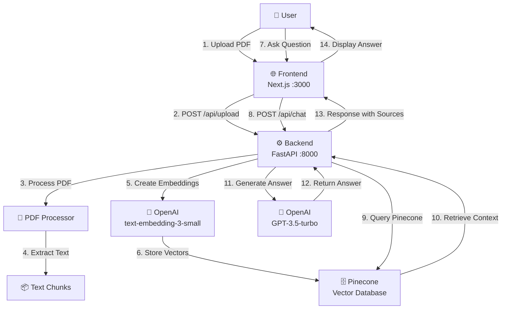

---

## 🔄 Complete Flow: File Upload to Answer

### Step 1: User Uploads PDF (Frontend)

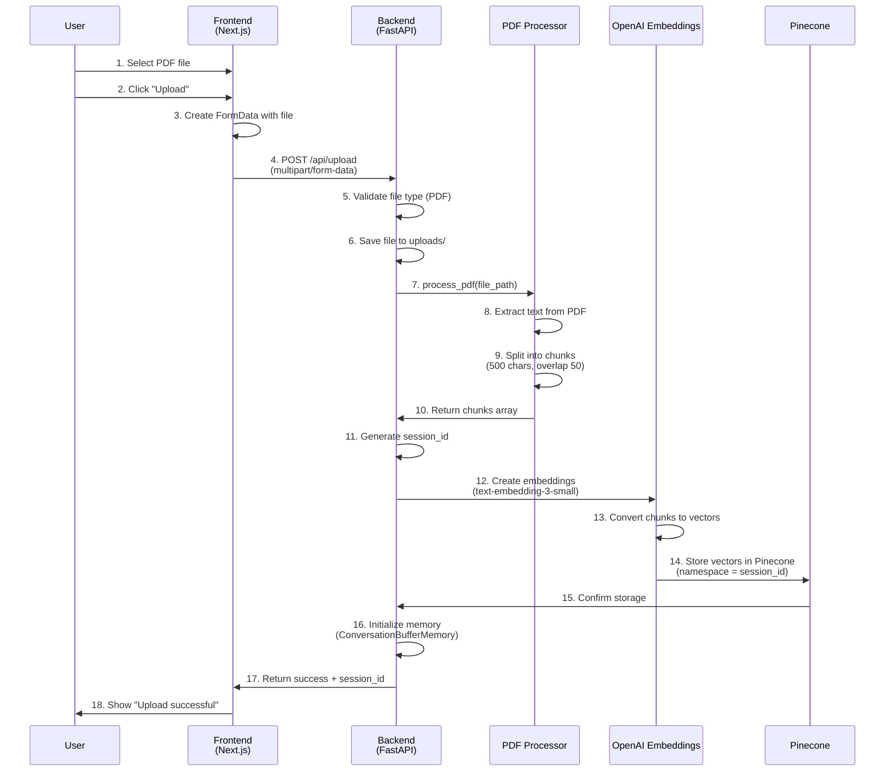

### Step 2: User Asks Question (Frontend → Backend)

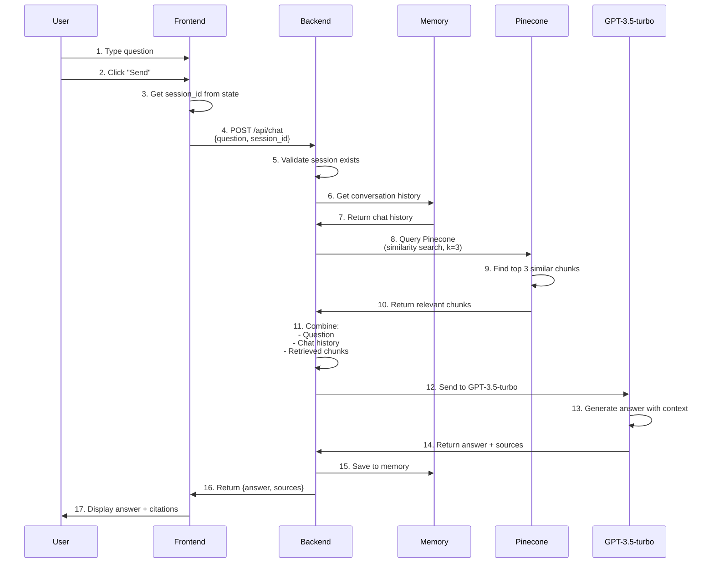

---

## 🎯 Frontend Flow (Detailed)

### Component Structure

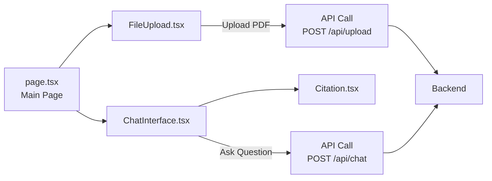

### File Upload Component Flow

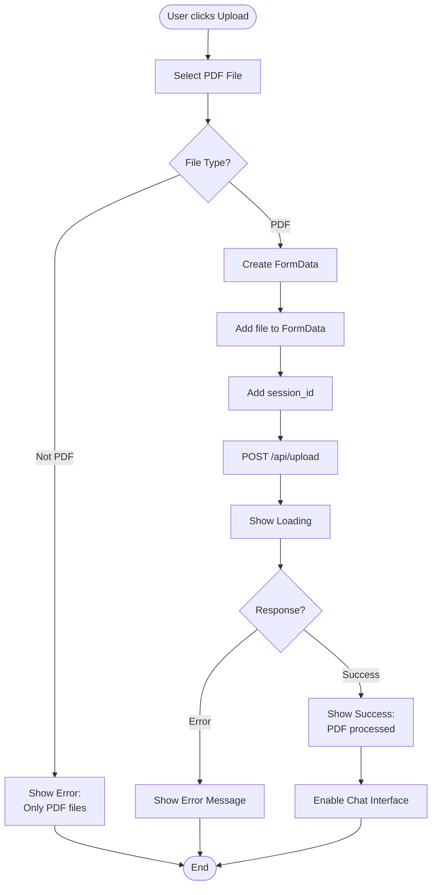

### Chat Interface Flow

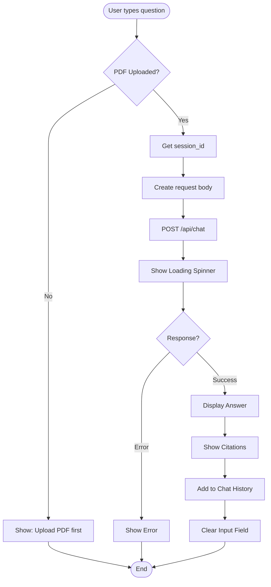

---

## ⚙️ Backend Flow (Detailed)

### Upload Endpoint Flow

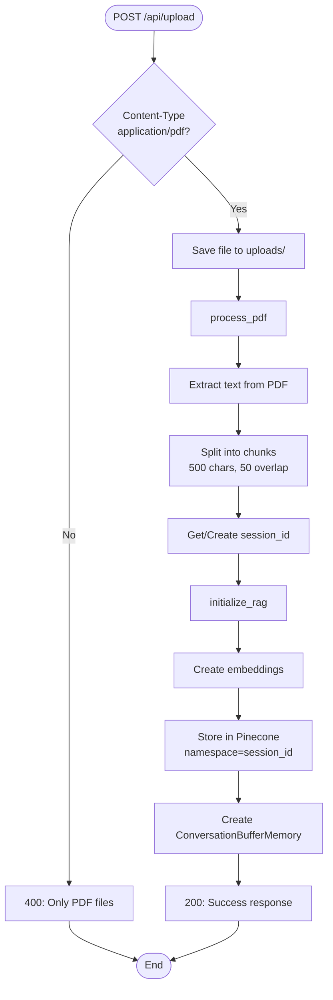

### Chat Endpoint Flow

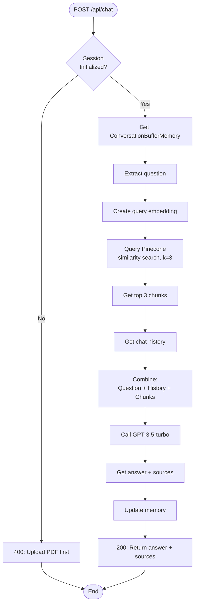

---

## 📦 Data Flow

### PDF Processing Pipeline

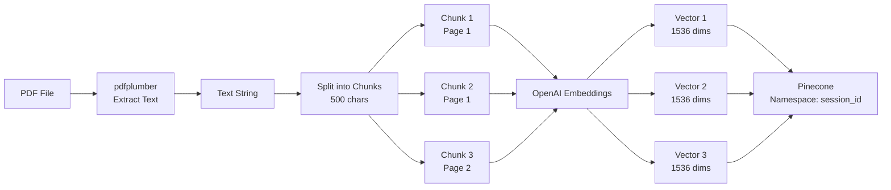

### RAG Query Pipeline

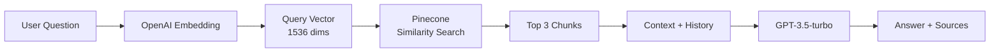

---

## 🔑 Key Components

### Frontend Components

| Component | Purpose | Key Features |
|-----------|---------|--------------|
| `FileUpload.tsx` | PDF upload UI | Drag & drop, file validation, progress |
| `ChatInterface.tsx` | Chat UI | Message display, input, loading states |
| `Citation.tsx` | Source citations | Display page numbers, chunk references |

### Backend Modules

| Module | Purpose | Key Functions |
|--------|---------|---------------|
| `main.py` | FastAPI app | API endpoints, CORS, routing |
| `pdf_processor.py` | PDF processing | Extract text, chunk documents |
| `rag_engine_pinecone.py` | RAG logic | Initialize RAG, query RAG, manage sessions |

### External Services

| Service | Purpose | Configuration |
|---------|---------|---------------|
| OpenAI | Embeddings & LLM | `text-embedding-3-small`, `gpt-3.5-turbo` |
| Pinecone | Vector Database | Serverless, AWS, namespace isolation |

---

## 📝 Session Management

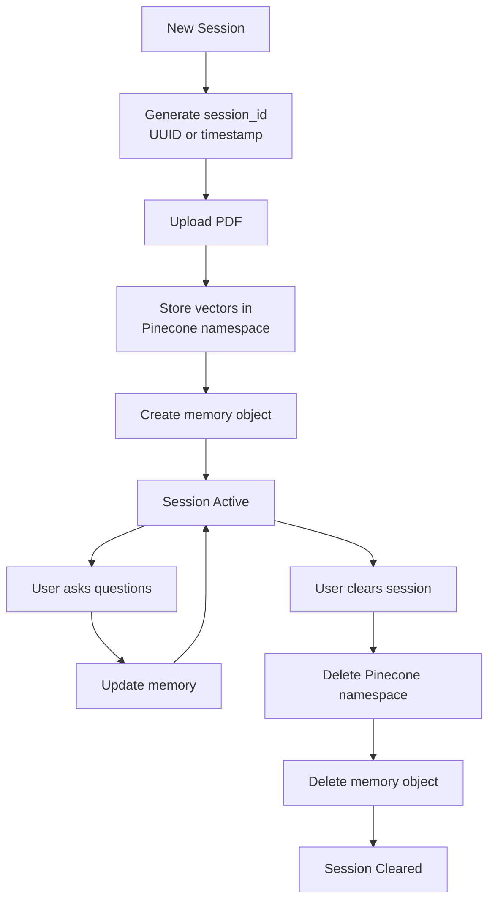

---

## 🔐 Environment Variables

### Frontend (`web/.env.local`)
```env
NEXT_PUBLIC_API_URL=http://localhost:8000
```

### Backend (`api/.env`)
```env
OPENAI_API_KEY=your_key
PINECONE_API_KEY=your_key
PINECONE_INDEX_NAME=pdf-rag-demo
PINECONE_ENVIRONMENT=us-east-1
```

---

## 🚀 API Endpoints

### POST `/api/upload`
- **Input**: `multipart/form-data` with PDF file
- **Output**: `{success: true, message: "...", chunks: 10, session_id: "..."}`
- **Process**: Extract → Chunk → Embed → Store

### POST `/api/chat`
- **Input**: `{question: "...", session_id: "..."}`
- **Output**: `{answer: "...", sources: ["Page 1, Chunk 1"], success: true}`
- **Process**: Query → Retrieve → Generate → Return

### DELETE `/api/session/{session_id}`
- **Input**: session_id in URL
- **Output**: `{success: true, message: "..."}`
- **Process**: Delete namespace → Clear memory

---

**This architecture supports scalable, production-ready RAG system!** 🎯

