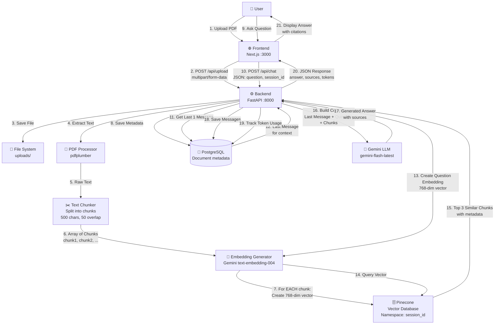

# 🔄 Corrected RAG System Flowchart

## ✅ **CORRECTED FLOW** (What Actually Happens)



---

## 🔍 **KEY CORRECTION: Embedding Creation**

### ❌ **WRONG (Old Flowchart):**
```
Text → Chunks → [Separate Step] → Create Embeddings → Store in Pinecone
```

### ✅ **CORRECT (Actual Flow):**
```
Text → Chunks → [For EACH chunk: Create Embedding] → Store in Pinecone
```

**What Actually Happens:**

1. **PDF → Text** (pdfplumber extracts all text)
2. **Text → Chunks** (split into multiple chunks, e.g., 20 chunks)
3. **For EACH Chunk:**
   - Create embedding using Gemini `text-embedding-004`
   - Get 768-dimensional vector
   - Store vector + chunk text + metadata in Pinecone
4. **All chunks stored** in Pinecone namespace (session_id)

---

## 📊 **Detailed Upload Flow**

```
Step 1: User uploads PDF
   ↓
Step 2: Backend receives file
   ↓
Step 3: Save to uploads/ directory
   ↓
Step 4: Extract text using pdfplumber
   ↓
Step 5: Chunk text (500 chars, 50 overlap)
   Result: [chunk1, chunk2, chunk3, ..., chunkN]
   ↓
Step 6: Initialize RAG Engine
   ↓
Step 7: For EACH chunk in chunks:
   ├─ Create LangChain Document object
   ├─ Call Gemini Embedding API
   ├─ Get 768-dim vector
   └─ Store in Pinecone with metadata
   ↓
Step 8: Save document metadata to PostgreSQL
   ↓
Step 9: Return success to frontend
```

**Code Reference:**
```python
# In rag_engine_pinecone.py, line 98-127
documents = [Document(...) for chunk in chunks]  # Step 7a
embeddings = GoogleGenerativeAIEmbeddings(...)   # Step 7b
vector_store = PineconeVectorStore.from_documents(
    documents,      # All chunks
    embeddings,     # Embedding model
    namespace=session_id
)  # Step 7c: Creates embeddings AND stores them
```

---

## 📊 **Detailed Query Flow**

```
Step 1: User asks question
   ↓
Step 2: Frontend sends POST /api/chat
   ↓
Step 3: Backend gets last 1 message from DB
   ↓
Step 4: Create question embedding (768-dim)
   ↓
Step 5: Query Pinecone with question vector
   ↓
Step 6: Pinecone returns top 3 similar chunks
   ↓
Step 7: Build prompt:
   - Last message (if exists)
   - Current question
   - Retrieved chunks (context)
   ↓
Step 8: Send to Gemini LLM
   ↓
Step 9: Get answer with sources
   ↓
Step 10: Save to database:
   - User message
   - Assistant message
   - Token usage
   ↓
Step 11: Return JSON response
   ↓
Step 12: Frontend displays answer
```

---

## 🎯 **Important Points**

### 1. **Embeddings are Created DURING Storage**
- Not a separate step
- `PineconeVectorStore.from_documents()` automatically:
  - Creates embeddings for each document
  - Stores vectors in Pinecone
  - All in one operation

### 2. **Each Chunk Gets Its Own Embedding**
- If PDF has 20 chunks → 20 embeddings created
- Each embedding is 768 dimensions (Gemini)
- All stored in same Pinecone index, different namespace

### 3. **Session Isolation**
- Each document uses `session_id` as Pinecone namespace
- Queries filter by namespace automatically
- No cross-contamination between documents

### 4. **Token Optimization**
- Only last 1 message used for context (POC requirement)
- Prevents token overflow on free tier
- Stored in PostgreSQL, retrieved on each query

---

## 🔧 **Technology Stack (Updated)**

| Component | Technology | Details |
|-----------|-----------|---------|
| Frontend | Next.js 14 | React, TypeScript |
| Backend | FastAPI | Python 3.13 |
| PDF Processing | pdfplumber | Text extraction |
| Text Chunking | Custom | 500 chars, 50 overlap |
| Embeddings | **Gemini** `text-embedding-004` | **768 dimensions** |
| Vector DB | Pinecone | Serverless, namespace isolation |
| LLM | **Gemini** `gemini-flash-latest` | Falls back to `gemini-pro-latest` |
| Database | PostgreSQL | Supabase/Neon |
| ORM | SQLAlchemy | Database operations |

---

## 📝 **Code Flow Reference**

### Upload Flow (main.py → rag_engine_pinecone.py)
```python
# 1. Upload endpoint receives file
@app.post("/api/upload")
async def upload_pdf(file, session_id, db):
    # 2. Save file
    # 3. Process PDF → chunks
    chunks = process_pdf(file_path)  # Returns list of chunk dicts
    
    # 4. Initialize RAG (creates embeddings + stores in Pinecone)
    initialize_rag(session_id, chunks)
    
    # 5. Save metadata to DB
    save_document(db, session_id, ...)
```

### Initialize RAG (rag_engine_pinecone.py)
```python
def initialize_rag(session_id, chunks):
    # 1. Convert chunks to LangChain Documents
    documents = [Document(...) for chunk in chunks]
    
    # 2. Create embedding model
    embeddings = GoogleGenerativeAIEmbeddings(...)
    
    # 3. Store in Pinecone (THIS creates embeddings automatically)
    vector_store = PineconeVectorStore.from_documents(
        documents,      # All chunks
        embeddings,     # Embedding model
        namespace=session_id
    )
    # ↑ This line does BOTH:
    #   - Creates embeddings for each document
    #   - Stores vectors in Pinecone
```

---

## ✅ **Summary**

**The corrected flow is:**
1. PDF → Text extraction
2. Text → Chunking (multiple chunks)
3. **For each chunk: Create embedding → Store in Pinecone** (happens together)
4. Save metadata to database
5. Query: Question → Embedding → Search Pinecone → Get chunks → LLM → Answer

**Key Fix:** Embeddings are created **during** the Pinecone storage operation, not as a separate step!

---

**This flowchart is now accurate!** ✅

