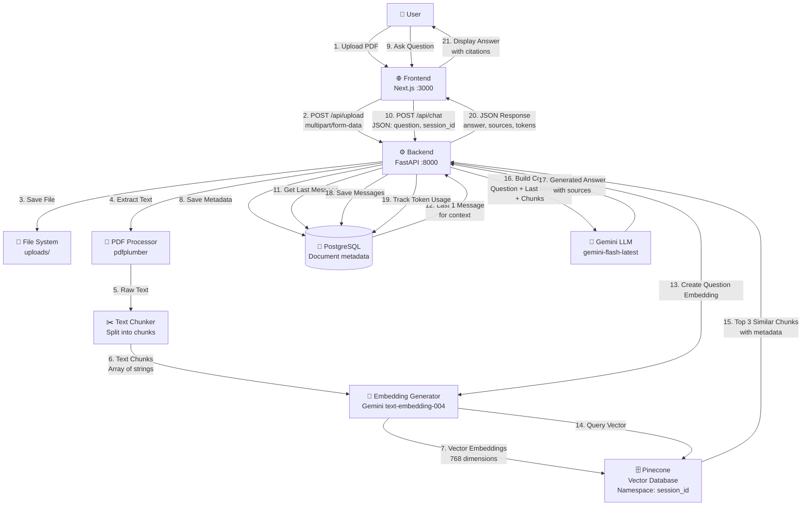

# 🔄 Complete RAG System Flowchart

## 📊 System Architecture Flow



---

## 🔍 Detailed Step-by-Step Flow

### **Phase 1: Document Upload & Processing**

1. **User Uploads PDF** → Frontend receives file
2. **Frontend → Backend** → `POST /api/upload` with file + session_id
3. **Backend Saves File** → Stores in `uploads/` directory
4. **Extract Text** → `pdfplumber` extracts all text from PDF
5. **Chunk Text** → Split into chunks (500 chars, 50 overlap)
6. **Create Embeddings** → For EACH chunk:
   - Call Gemini `text-embedding-004`
   - Get 768-dimensional vector
7. **Store in Pinecone** → Each chunk stored with:
   - Vector (768 dims)
   - Metadata: `{text, chunk_index, session_id}`
   - Namespace: `session_id`
8. **Save to Database** → Document metadata:
   - session_id, filename, file_size, chunk_count

### **Phase 2: Question Answering**

9. **User Asks Question** → Frontend sends question
10. **Frontend → Backend** → `POST /api/chat` with question + session_id
11. **Get Context** → Backend queries database for:
    - Last 1 message (for conversation context)
12. **Create Question Embedding** → Embed the question using Gemini
13. **Query Pinecone** → Search for top 3 similar chunks:
    - Uses cosine similarity
    - Filters by session_id namespace
14. **Retrieve Chunks** → Get the actual text chunks from results
15. **Build Prompt** → Combine:
    - Last message (if exists)
    - Current question
    - Retrieved chunks (as context)
16. **Call LLM** → Send to Gemini `gemini-flash-latest`:
    - Falls back to `gemini-pro-latest` if quota exceeded
17. **Get Answer** → LLM returns answer with source references
18. **Save to Database** → Store both:
    - User message
    - Assistant message (with sources)
    - Token usage tracking
19. **Return Response** → JSON with:
    - `answer`: The generated answer
    - `sources`: Array of source chunk texts
    - `token_count`: Total tokens used
20. **Frontend Displays** → Shows answer with clickable citations

---

## 🎯 Key Features

### **Token Optimization (POC)**
- ✅ Only last 1 message used for context
- ✅ Prevents token overflow on free tier
- ✅ Sliding window approach

### **Vector Search**
- ✅ Semantic similarity search
- ✅ Top 3 most relevant chunks
- ✅ Session-based isolation (namespace)

### **Database Integration**
- ✅ Document metadata storage
- ✅ Chat history persistence
- ✅ Token usage tracking

---

## 🔧 Technology Stack

| Component | Technology |
|-----------|-----------|
| Frontend | Next.js 14, React, TypeScript |
| Backend | FastAPI, Python 3.13 |
| PDF Processing | pdfplumber |
| Embeddings | Google Gemini `text-embedding-004` (768 dims) |
| Vector DB | Pinecone (Serverless) |
| LLM | Google Gemini `gemini-flash-latest` |
| Database | PostgreSQL (Supabase/Neon) |
| ORM | SQLAlchemy |

---

## 📝 Important Notes

1. **Embeddings are created AFTER chunking** - Each chunk gets its own embedding
2. **Pinecone stores vectors + metadata** - Not just vectors
3. **Session isolation** - Each document has its own Pinecone namespace
4. **Token optimization** - Only last 1 message for context (POC requirement)
5. **Fallback mechanism** - Gemini Flash → Gemini Pro if quota exceeded

---

## 🚀 Flow Summary

```
Upload: PDF → Text → Chunks → Embeddings → Pinecone + Database
Query: Question → Embedding → Pinecone Search → Chunks + Last Message → LLM → Answer → Database → Frontend
```

---

**This flowchart is now accurate!** ✅

