# 📊 Flowcharts - Complete System Flow

## 🎯 Main User Journey

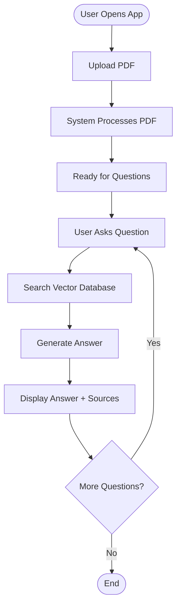

---

## 📤 File Upload Flow

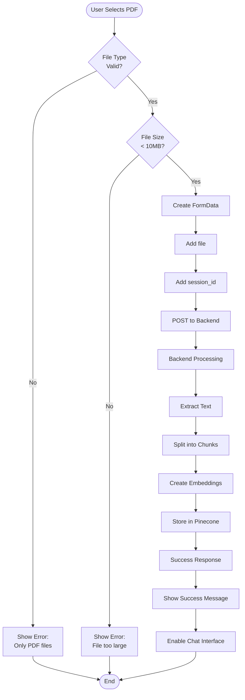

---

## 💬 Chat Flow

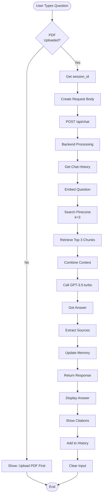

---

## 🔄 RAG Pipeline

```mermaid
flowchart LR
    A[PDF Document] --> B[Text Extraction]
    B --> C[Text Chunking]
    C --> D[Embedding Generation]
    D --> E[Vector Storage<br/>Pinecone]
    E --> F[User Question]
    F --> G[Question Embedding]
    G --> H[Similarity Search]
    H --> I[Retrieve Context]
    I --> J[Combine with History]
    J --> K[LLM Generation]
    K --> L[Answer + Sources]
```

---

## 🧠 Memory Management

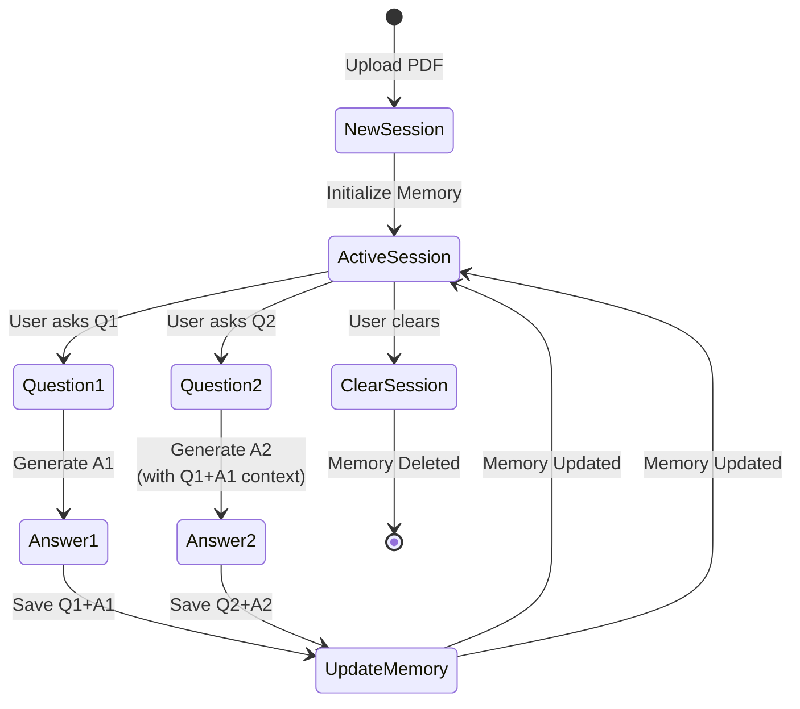

---

## 🗄️ Data Storage Flow

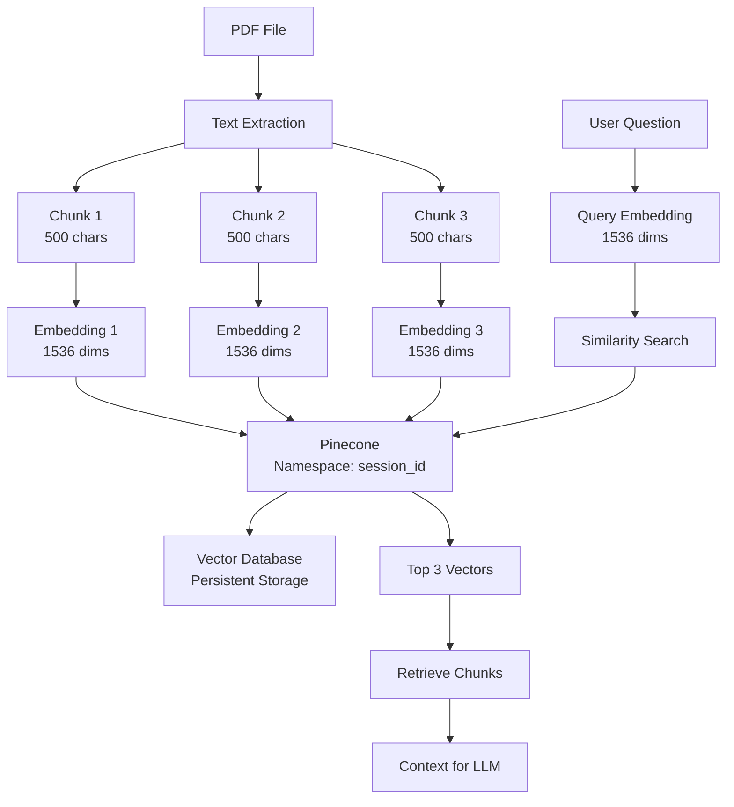

---

## 🔍 Query Processing Detail

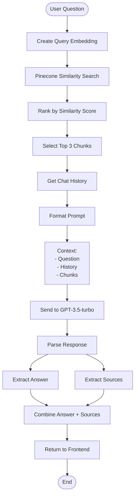

---

## 🏗️ System Architecture

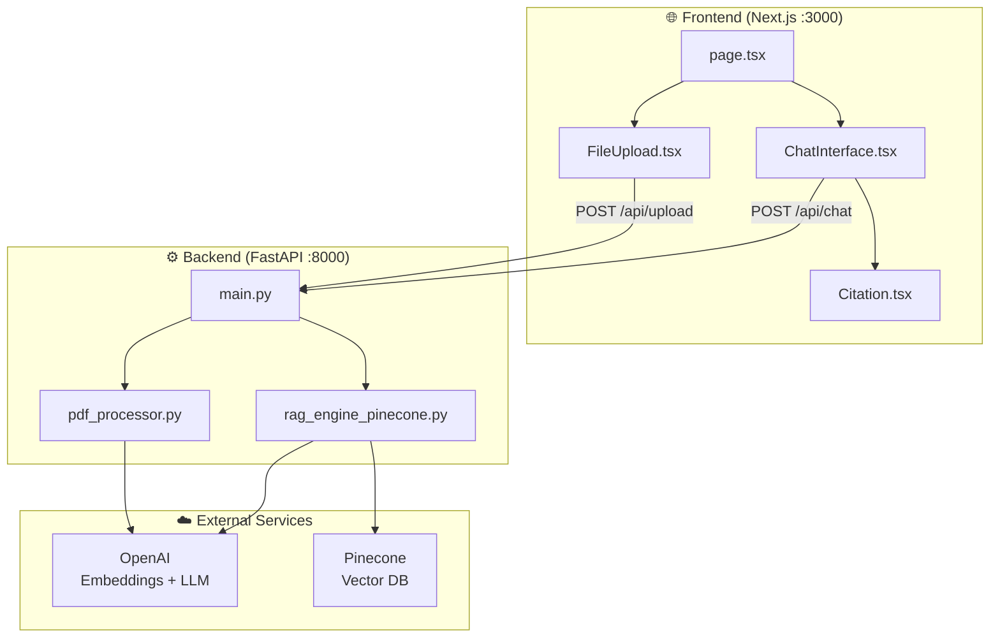

---

## 🔐 Session Lifecycle

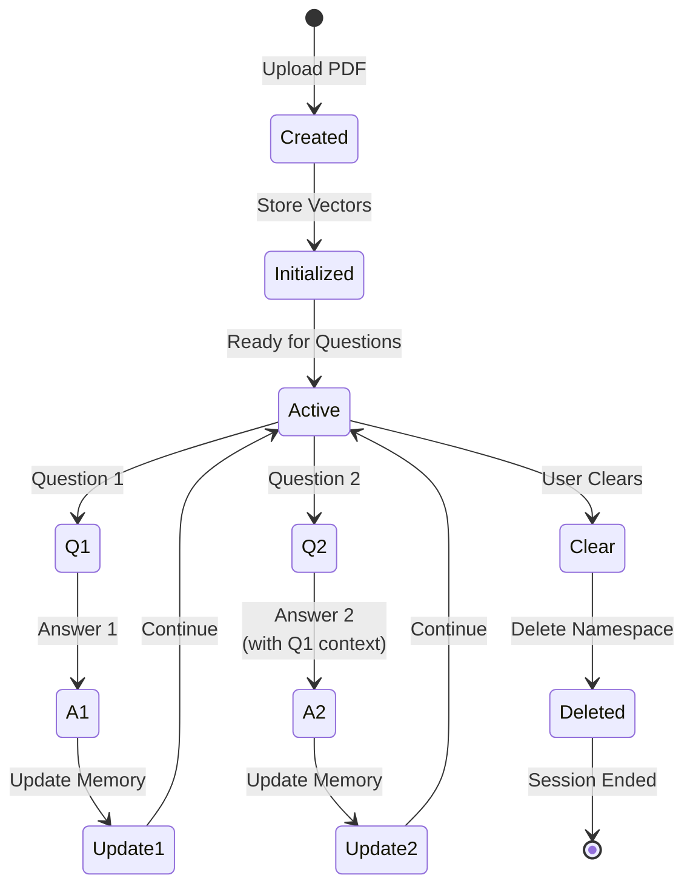

---

## 📊 Error Handling Flow

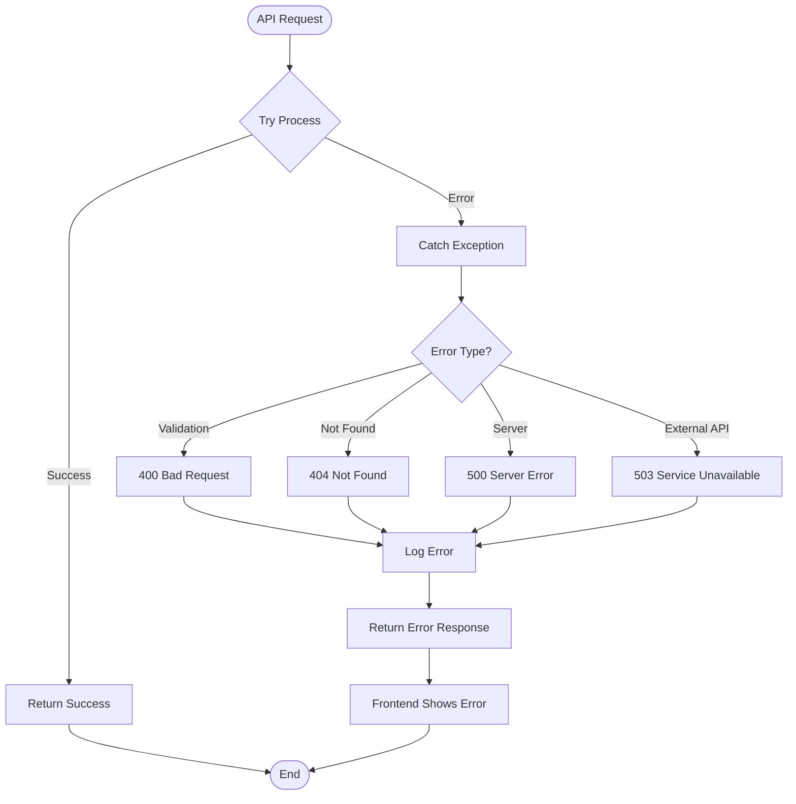

---

## 🚀 Deployment Flow

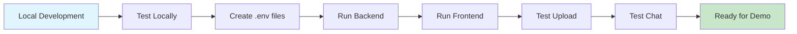

---

## 📝 Complete Request-Response Cycle

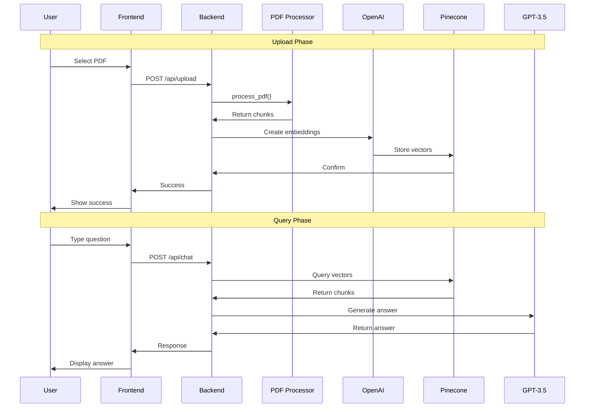

---

**All flowcharts show the complete system architecture!** 🎯

